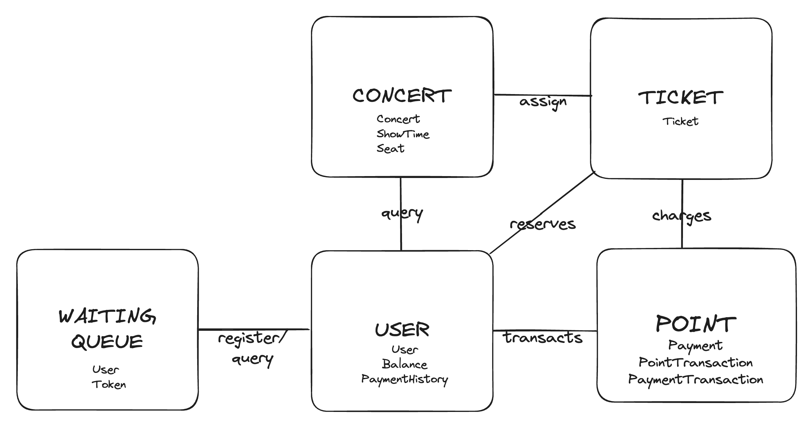
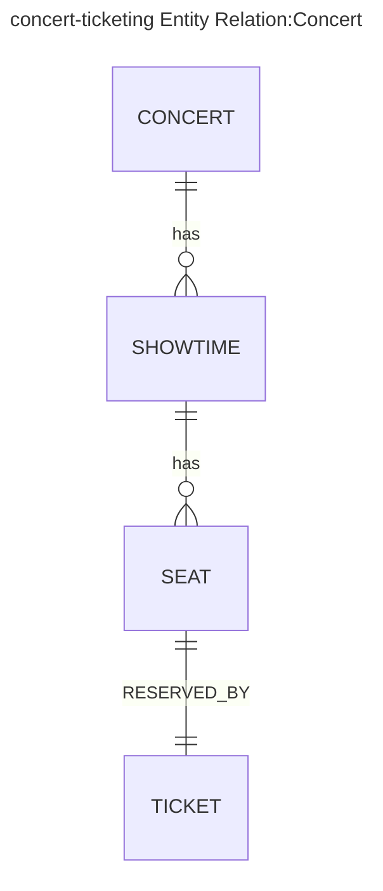
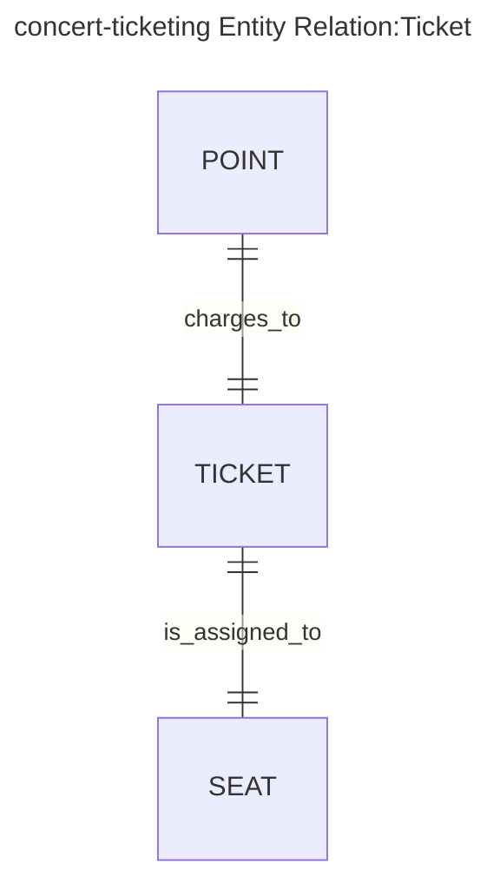
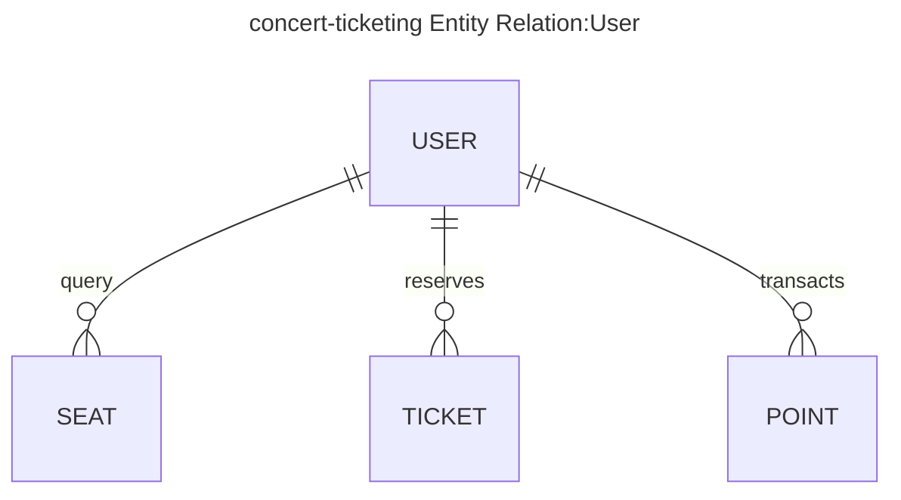
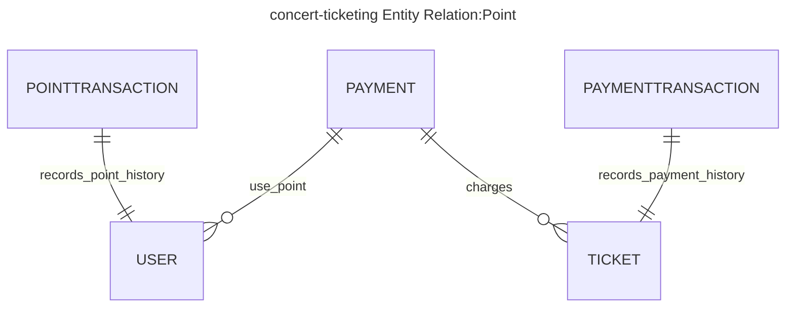
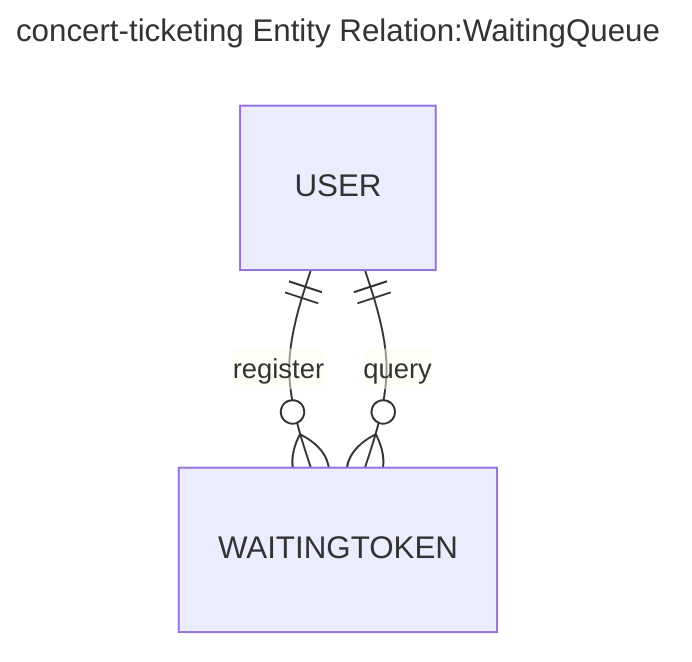

### 어그리게이트 분류
*AG=Aggregation Root  
Concert 도메인- Concert, Showtime, Seat(AG)  
Ticket 도메인- Ticket  
User 도메인 - User  
Point 도메인 - Payment, PointTransaction, PaymentTransaction      
WaitingQueue 도메인 - Token  
 

**'굳이 이렇게 도메인을 나눌 필요가 있냐'에 대하여**  
있다. 지금은 요구사항이 복잡하지 않지만, 서비스를 운영하면서 추가적인 비즈니스 요구사항이 주어질 수 있다. 도메인이 확실하게 구분되어있으면, 요구사항이 어떤 도메인에 속하는지 파악이 가능하고, 더 확실하게 분류할 수 있다.
티켓은 당장은 티켓 엔티티밖에 없어서, 유저 도메인과 포인트 도메인을 합치는 게 복잡성을 줄이는데 도움이 될 것처럼 보인다. 하지만, 시간이 지날수록 각 도메인의 책임이 뚜렷해질 수 있다. 만약 할인행사를 한다고 하면 DiscountPolicy와 같은 엔티티가 추가될 수 있다. 유저 관리를 유저 도메인에서 하는 건 자연스럽지만, 할인정책을 유저 도메인에서 처리하는 건 어딘가 부자연스럽다.
 

### 도메인 간 연관관계  

Concert - Ticket(Ticket)  
Ticket - Concert(Seat), Point(Payment)  
User - Point(Payment), Point(PaymentTransaction), Ticket(Ticket)    
Point - User(Balance), Ticket(Ticket)    
WaitingQueue - User(User)  

 

### ERD(Entity Relation Diagram)

#### 콘서트(Concert)
- 도메인간 연관관계 
  - Concert - Ticket(Ticket)

 

#### 티켓(Ticket)
- 도메인간 연관관계 
  - Ticket - Concert(Seat), Point(Payment)

 

#### 유저(User)
- 도메인간 연관관계
  - User - Point(Payment), Point(PaymentTransaction), Ticket(Ticket)

 

#### 포인트(Point)
- 도메인간 연관관계
  - Point - User(Balance), Ticket(Ticket)

 

#### 대기열(WaitingQueue)
- 도메인간 연관관계 
  - WaitingQueue - User(User)

