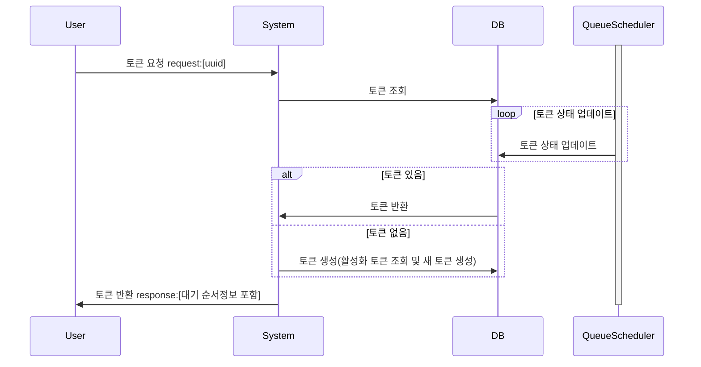
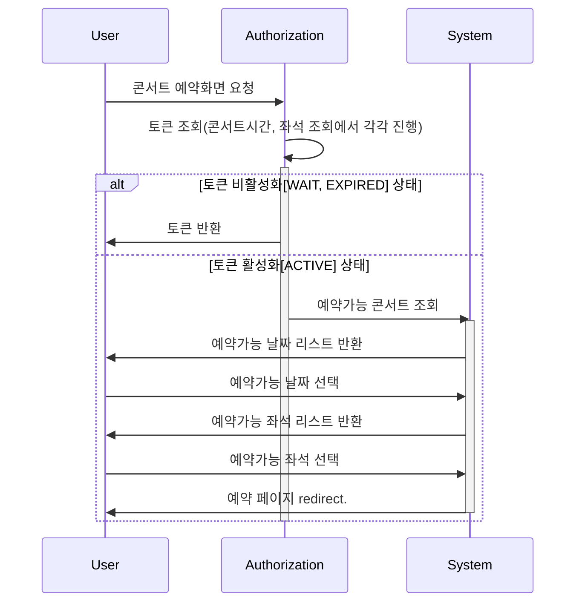
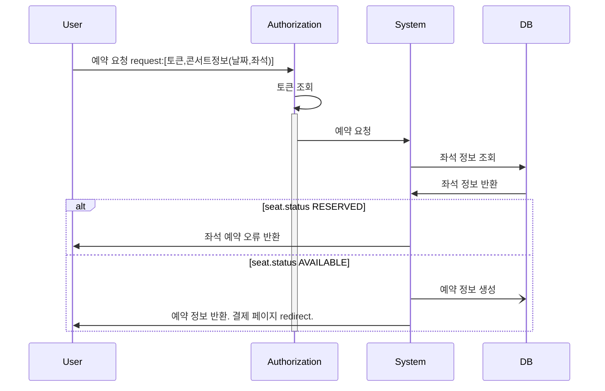
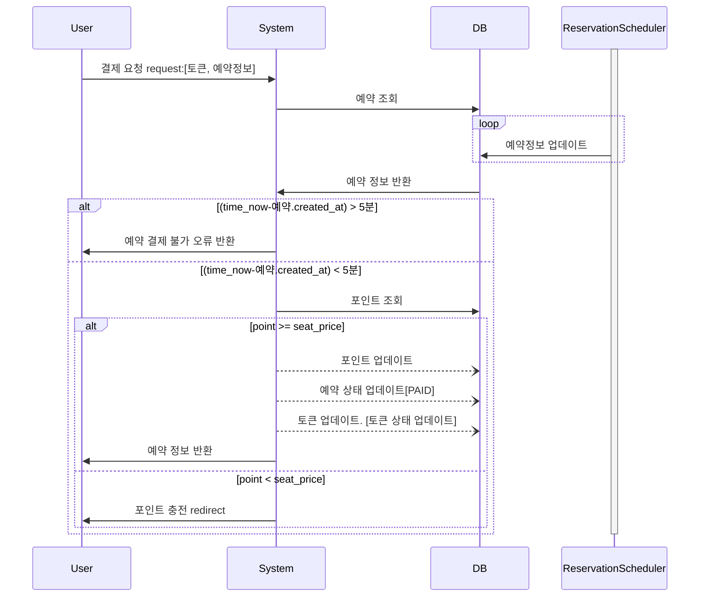
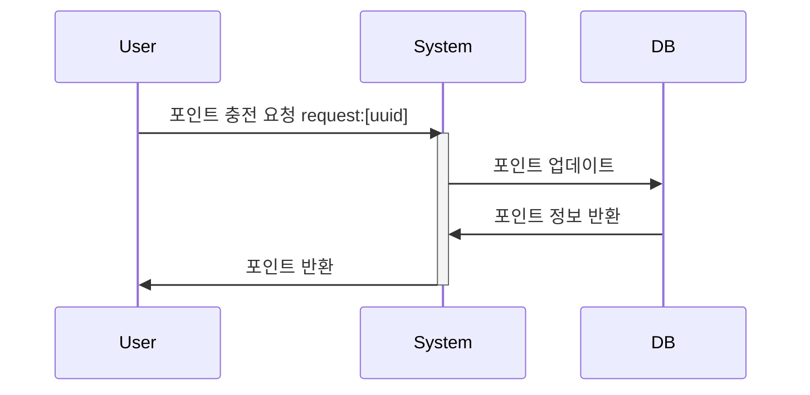

설명: 콘서트 예약 대기열 구현을 위한 각 API별 세부 시퀀스 다이어그램

# 토큰 발급/조회
토큰 요청 상황
1. 콘서트 예약화면 요청
2. 콘서트 날짜조회
3. 콘서트 좌석조회
4. 좌석 예약 요청

```mermaid
sequenceDiagram
		activate QueueScheduler		
		User->>System: 토큰 요청 request:[uuid]
		System->>DB: 토큰 조회
		
		loop 토큰 상태 업데이트
		QueueScheduler->>DB: 토큰 상태 업데이트
		end
		
		alt 토큰 있음
		DB->>System: 토큰 반환
		
		else 토큰 없음
		System->> DB: 토큰 생성(활성화 토큰 조회 및 새 토큰 생성)
		

		end
		
		System->>User: 토큰 반환 response:[대기 순서정보 포함]
		deactivate QueueScheduler
```

# 콘서트 조회

```mermaid
sequenceDiagram
		User->>Authorization: 콘서트 예약화면 요청
		Authorization->>Authorization: 토큰 조회(콘서트시간, 좌석 조회에서 각각 진행)
		activate Authorization
		alt 토큰 비활성화[WAIT, EXPIRED] 상태
		Authorization->>User: 토큰 반환 
		
		else 토큰 활성화[ACTIVE] 상태
		Authorization->> System: 예약가능 콘서트 조회
		activate System
		System->>User: 예약가능 날짜 리스트 반환
		
		
		User->>System: 예약가능 날짜 선택
		System->>User: 예약가능 좌석 리스트 반환
		User->>System: 예약가능 좌석 선택 
		System->>User: 예약 페이지 redirect.
		deactivate System
		end
		deactivate Authorization		
```

# 예약 요청

```mermaid
sequenceDiagram
User->>Authorization:예약 요청 request:[토큰,콘서트정보(날짜,좌석)]
Authorization->>Authorization: 토큰 조회
activate Authorization
Authorization->>System: 예약 요청
System->>DB: 좌석 정보 조회
DB->>System: 좌석 정보 반환

alt seat.status RESERVED
	System->>User: 좌석 예약 오류 반환	
else seat.status AVAILABLE
	System-) DB: 예약 정보 생성
	System->>User: 예약 정보 반환. 결제 페이지 redirect.
	
end
deactivate Authorization

```

# 결제

```mermaid
sequenceDiagram
activate ReservationScheduler
User->>System: 결제 요청 request:[토큰, 예약정보]

System->>DB: 예약 조회
loop 
ReservationScheduler->>DB: 예약정보 업데이트
end
DB->>System: 예약 정보 반환
alt (time_now-예약.created_at) > 5분
	System->>User: 예약 결제 불가 오류 반환
else (time_now-예약.created_at) < 5분
	System->> DB: 포인트 조회
	alt point >= seat_price
		System--) DB: 포인트 업데이트
		System--) DB: 예약 상태 업데이트[PAID]
		System--) DB: 토큰 업데이트. [토큰 상태 업데이트]
		System->>User: 예약 정보 반환
	else point < seat_price
		System->> User: 포인트 충전 redirect
	end
end
deactivate ReservationScheduler
```

# 포인트 충전

```mermaid
sequenceDiagram
User->>System: 포인트 충전 요청 request:[uuid]
activate System
System->>DB:포인트 업데이트
DB->>System: 포인트 정보 반환

System->>User: 포인트 반환
deactivate System
```