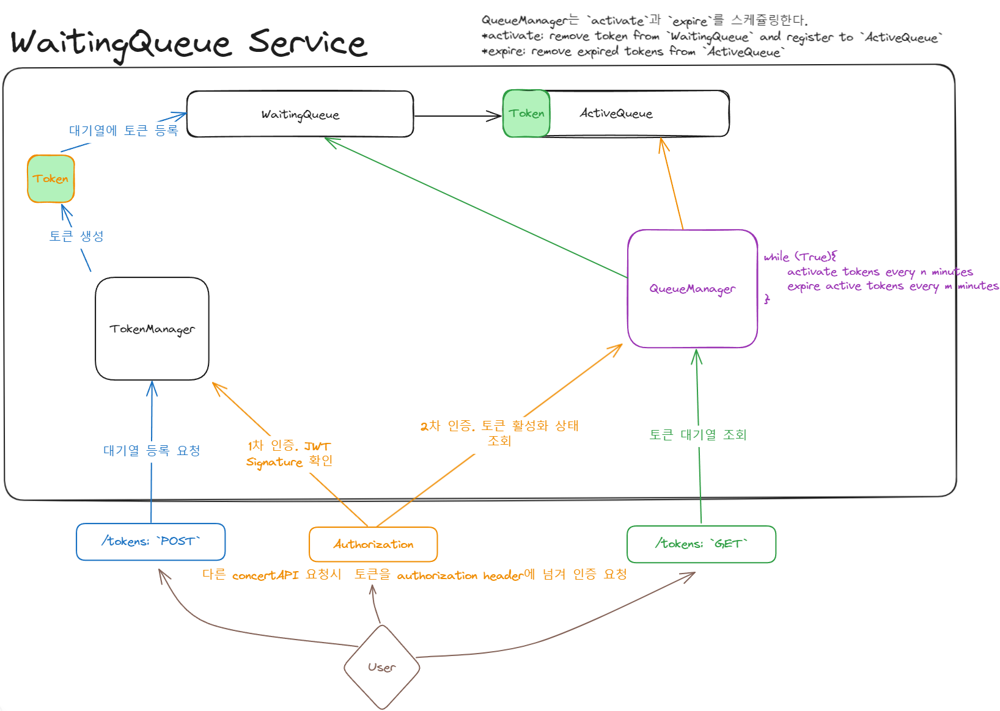

### 대기열 시나리오

- 티켓 예매 시간에 맞춰 짧은 시간에 많은 사용자가 접근할 경우, 서버가 터질 수도 있다. 
- 이런 대용량 트래픽을 처리하기 위해, **순차적으로 서비스에 접근권을 부여하는 대기열**을 구현한다.

 

### 대기열 요구조건

- 트래픽 부하 분산 <- 가장 중요
- 사용자의 입장순서를 기억하고 순차적으로 접근권을 부여
- 사용자는 대기열 순번을 조회할 수 있다.
- 접근권에 대한 트롤(접근권 임의 조작) 방지

 

### 구현을 위한 요구조건 구체화
- `접근권`: 사용자가 서버에게 제공하는 인증 토큰 => cookie, session, jwt 리스트업
- `대기열`: 사용자 입장순서를 기록. => RDB(MySQL, PostgresSQL), 인메모리-DB 리스트업.
- `모니터링`: 주기적으로 대기열을 모니터링하고 순차적으로 접근권 부여. => 스케쥴러 

 

### 구현
- 대용량 트래픽을 가정하기 때문에 최대한 빠르고 가벼운 서비스를 택해야한다.

#### 대기열
- `대기열` 구현에 RDB를 사용할 경우, 대기열 등록을 위해 서버에 부하를 주게된다. 
  - 대기열 구현의 본 목적이 트래픽 부하를 분산시키는 건데, RDB를 사용하면, 감당하려고 하는 트래픽을 그대로 서버에서 부담하는 것과 마찬가지다. (+DB는 스케일아웃이 어렵다.)
  - 그러므로 가볍고 휘발성의 인메모리 DB를 채택한다.
  - 인메모리 DB로 채택한 인프라는 `Redis`다.
  - 시간 순서대로 입장하기 위해서는 Sorted Set을 활용한다.
  - Sorted Set은 Score를 기반으로 값을 정렬된 상태로 저장한다. Score를 대기열 등록시간, 그리고 값을 `접근권`으로 설정하여, 등록시간이 이른 순서대로 입장시킨다.
  - `대기상태`와 `서비스 접근가능 상태`를 구분하기 위해 Sorted Set 키를 2개로 설정한다. `대기열 키`와 `활성화열 키`로 지정한다.
    - 사용자가 접근권을 http request의 Authorization header에 담아 대기열 순번 조회 요청을 보냈을 때, 서버는 해당 사용자의 접근권이 대기열의 몇번째에 있는지 조회하여 응답한다. 
    - 사용자가 접근권을 http request의 Authorization header에 담아 예매 서비스 관련 요청을 보냈을 때, 서버는 해당 사용자의 접근권이 활성화열에 있는지 조회하여, 서비스 접근 가능 유무를 판단한다.
     
#### 접근권(토큰)
- 사용자는 대기열 등록 후, 부여받은 접근권으로 서비스에 접근한다.(이제부터 이 접근권을 토큰이라고 부른다.)
- 토큰은 서버에 부하를 최소한으로 주어야하고, 안전해야한다.
  - 애초에 리스트업한 토큰의 데이터 구조 후보로는 cookie, session, jwt가 있었는데, cookie나 session의 경우 서버에 부하를 줄 수 있으므로 제외한다.
  - JWT는 header와 payload에 담긴 정보와 signature(서버의 secret key로 복호화) 정보를 매칭하여 토큰의 유효성을 판별한다.
    - 토큰 탈취를 방지하기 위해 토큰 만료 시간을 짧게 잡고, 이중 토큰으로 보안을 강화할 수는 있지만, 콘서트 예매를 위한 대기열이라는 특성상 토큰이 유효한 기간이 짧기 때문에 생략했다.

#### 모니터링
- 주기적으로 대기열 등록시간순으로 토큰을 활성화시킨다.
- 토큰 유효시간을 정해 주기적으로 활성화열에서 유효시간이 만료된 토큰을 비활성화시킨다. <- 티켓 예매 실패 시, 사용자 경험으로 바로 이어질 수 있으므로 최대한 유효시간을 길게 가져간다. 

### 동작 구조
- WaitingQueueService(TokenManger, QueueManager)
  - TokenManager: 토큰 생성, 검증 담당
  - QueueManager: 토큰 등록, 조회, 활성화/비활성화 스케쥴링

#### TODO
- [ ] : 각 기능에 필요한 토큰 검증은 비즈니스 관심사라기보다는 서비스 전역에 흩어져 있는 횡단 관심사이다. 토큰 검증을 Aop로 만들어, 코드를 깔끔하게 유지하자.