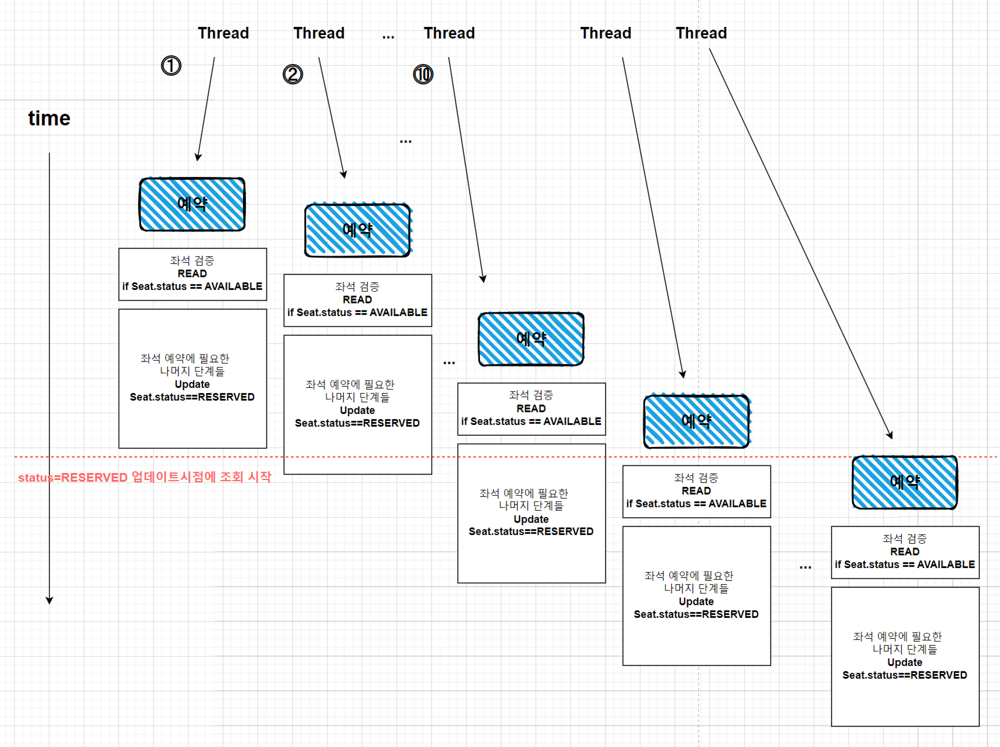

## 동시성 제어가 필요한 이유
트래픽이 몰렸을 때, 데이터 정합성이 깨지는 경우가 발생할 수 있다.

동일한 데이터에 대해 1개이상의 트랜잭션이 ‘동시에’ 관여할 경우다.

여러 트랜잭션이 한 번에 데이터를 읽기 또는 쓰기를 하지 못 하도록 제한하여, 정합성을 보장할 필요가 있다.

동시성 제어를 위해 먼저 프로젝트에서 동시성 이슈가 발생할만한 api를 정의하고, 정합성을 확인하기 위한 테스트 코드를 먼저 작성해보자.


## 프로젝트에서 동시성 제어가 필요한 케이스 
먼저 동시성 이슈가 발생할만한 API는 **좌석 예약**과 **포인트 충전**이다.

(좌석 조회는 단순 읽기이므로 정합성이 깨질 걱정을 하지 않아도 되고, 예약 같은 경우, 예약(자원)이 개인에게만 할당되어있기 때문에 다른 트랜잭션이 침범할 걱정을 하지 않아도 된다)

그럼 좌석 예약과 포인트 충전에 대한 동시성 제어 테스트 코드를 작성해보자.


### Case1) 티켓 예약 생성
먼저 예약에 대한 서비스 코드이다.

```java
class TicketController(){
	reserve(TicketRequest request){
        좌석 조회()
        좌석 검증()
		좌석 상태 업데이트()
		예약 생성()
		
	}
}
```

#### 요구사항 정리
그럼 이 서비스 코드에 대한 요구사항을 정의해보자.

동시에 여러 예약 요청이 들어올 때,

- 좌석 예약은 사용자 한 명에게만 할당될 수 있다.
- 이미 예약된 좌석이라면, 나머지 요청들은 실패해야한다.

Given: 동시에 여러 예약 요청이 들어올 때

When: 예약 요청 수행

Then: 사용자 한 명에게만 할당된다.  / 나머지 요청들은 실패한다.

동시에 여러 예약 요청이 들어오는 상황(Given)을 구현하기 위해서, 쓰레드를 사용한다.

```java
import java.util.concurrent.CountDownLatch;
import java.util.concurrent.ExecutorService;
import java.util.concurrent.Executors;

int threadCount = 20;
ExecutorService executorService = Executors.newFixedThreadPool(threadCount);
CountDownLatch latch = new CountDownLatch(threadCount);

for (int i=0; i<threadCount; i++){
	executorService.submit(() -> 
	// 예약 요청 수행
	latch.countDown(); // 쓰레드 완료를 카운트한다.
} 
latch.await(); // 모든 쓰레드가 끝날 때까지 기다린다.
```

첫번째 요청 외 나머지 요청들이 전부 실패하는 것을 검증하기 위해서 successCnt와 failCnt를 두어 성공횟수와 실패횟수를 카운트해보자.

예를 들어 threadCount가 20일 때, 성공횟수는 1, 그리고 실패횟수는 19가 되어야한다.

멀티쓰레드를 활용하는 상황에서는 데이터의 업데이트가 중첩되서 이뤄질 수 있기 때문에 succeCnt, failCnt는 그냥 Integer가 아닌 AtomicInteger를 사용해야한다.

(AtomicInteger는 값을 업데이트 하기 전에, CAS(CompareAndSwap, 메모리 값 A를 업데이트하기 전, 처음에 읽은 메모리 값과 변경전 다시 읽은 메모리의 값 A가 같을 경우에만 업데이트를 진행, 아닐 경우에는 재시도) 방식과 volatile(해당 값이 캐쉬되지 않고 모든 쓰레드에게 보여질 수 있게 함) ← 이 내용은 Atomic과 Volatile 키워드로 더 공부해야봐야겠다.

그럼 코드는

```java
AtomicInteger successCnt = new AtomicInteger(0);
AtomicInteger failCnt = new AtomicInteger(0);

for (int i=0; i<threadCount; i++){
	executorService.commit(() ->
		try {
		// 예약 요청 수행
			successCnt.IncrementAndGet();
		}catch (Exception e){
			failCnt.incrementAndGet();	
		}
}

assertThat(successCnt).isEqualTo(1);
assertThat(failCnt).isEqualTo(threadCount - 1);
assertThat(targetSeat.getStatus()).isEqualTo(RESERVED);
```

정리된다.  

테스트는 예상한대로 실패한다.  

결과를 출력해보면,  

```java
# Success: 10 # Fail: 10
```

10건은 예약에 성공하고, 나머지 10건은 실패했다.  

그렇다면 이번엔 threadCount를 40으로 바꿔서 돌려본다.  

```java
# Success: 10 # Fail: 30
```

10건은 예약에 성공하고, 나머지 30건은 실패했다.  

왜 10건은 성공하고, 나머지는 다 실패하는 걸까?  

다음과 같은 상황이라고 예측할 수 있다.  

예약 트랜잭션은 (좌석 검증 - 좌석 조회 - 좌석 상태 업데이트 - 예약 생성) 과정을 거친다.  

모든 쓰레드가 전부 동시에 실행될 수는 없기 때문에 트랜잭션 시작시점이 조금씩 달라진다. 그러다보면 다른 쓰레드들이 좌석 상태 업데이트를 이미 진행했을 때, 뒤에 실행되는 트랜잭션들은 좌석 조회 단계에서 업데이트된 좌석 상태를 확인하고 검증단계에서 실패하게 되는 것이다.  

  

같은 자원에 대해 동시에 여러 트랜잭션들이 접근하다보니 정합성이 깨지게 된 것이다.  

본질적인 해결법은 같은 자원에 대해 트랜잭션이 하나씩만 접근할 수 있도록 제한하는 것이다.

## 동시성 제어 방법 - Lock

그럼 이제 자원 접근 권한을 제어하는 방법에 대해서 알아보자.  

- 트랜잭션 격리 수준을 조정할 수 있다. READ UNCOMMITTED, READ COMMITTED, REPEATABLE READ, SERIALIZABLE 등 트랜잭션 격리 수준이 있긴 하지만, (SERIALIZABLE을 제외하고는)동시성 제어를 위해서는 락이 필요하다. 이번 글에서는 이 부분은 스킵하도록 하자.  

데이터에 락을 걸어보자.  

- 낙관적 락  
    - 데이터베이스에 lock을 걸지 않고, 어플리케이션 레벨에서 엔티티에 version 정보를 담아 처리하는 방식이다.
    - 위에 AtomicInteger가 동작하는 방식과 마찬가지로 CAS를 활용한다.
    - version 정보를 트랜잭션 시작과 끝에 확인해서 트랜잭션 도중에 정보가 변하지 않았음을 확인하는 방식이다.
    - 단점은 낙관적 락은 기본적으로 트랜잭션 충돌이 적을 것을 가정한다. 버젼을 수정한 최초 하나의 트랜잭션 빼고는, 버젼 불일치로 나머지 트랜잭션은 전부 다 실패하게 되기 때문에, 예외처리가 필수적이다. 만약 예외처리가 났을 때, 값을 다시 수정하는 시도를 한다고 하면, 몇 번 이상 실패할지 보장할 수 없다.
      ⇒ retry가 많아지면 자연스럽게 DB connection 시도가 많아지게 되고, 성능 저하로 이어진다. 그러므로 트랜잭션 충돌이 적다고 가정하는 낙관적인 상황에 적합하다.

- 비관적 락
    - 데이터베이스(Table or Block)에 락(s-lock or x-lock)을 걸어 다른 트랜잭션이 접근하지 못 하게 제어한다.
    - 나머지 트랜잭션들은 락을 획득할 때까지 대기해야한다.
    - 충돌이 많을 것이라고 예상되는 경우에 비관적 락을 사용하면, 순차적으로 트랜잭션들을 처리할 수 있다.
    - 단점은 락으로 인한 대기 때문에 요청 처리 속도가 느려질 수도 있고, 두 트랜잭션이 서로가 점유한 자원에 대해 대기하고 있는 데드락이 발생할 수 있다. ⇒ READ 작업이 잦을 경우 적합하지 않다.
- 분산락 사용하기
    - DB가 분산될 경우, 더이상 DB락을 사용할 수 없다.
    - 해당 자원에 대해 여러 트랜잭션 처리 방법들이 있다고할 때, 전부다 분산락을 쓴다면 문제 없겠지만, 일부 처리에서 분산락이 아닌 DB락을 사용한다고 할 때, DB락을 사용한 처리가 분산락을 사용한 처리보다 먼저 처리되는 경우가 발생할 수 있다(분산락 네트워크 홉 > DB락 네트워크 홉)
    - 락 획득/해제를 별도의 서버에서 관리한다.
    - 분산된 인스턴스에서의 트랜잭션들도 한꺼번에 관리할 수 있다.
    - DB 커넥션을 얻기 전에 트랜잭션의 성공여부를 체크하기 때문에 DB락에서 데이터베이스에 연결하면서 생기는 DB부하를 해결해줄 수 있다.
    - 트랜잭션 시작 전을 기준으로 락을 획득하고, 트랜잭션 종료 후에 락을 해제하는 것이 중요하다.
        - 예를 들어, (조회 → 락 대기 → 락 획득 → 수정) 하는 과정을 거치게 되면, 조회에서 업데이트 이전(다른 트랜잭션이 업데이트를 했다는 가정하에)의 오래된 데이터를 읽어오는 문제가 발생할 수 있다.

그럼 다시 `좌석예약` 케이스로 돌아와서 락 종류들을 구현해보자.  

먼저 낙관적 락이다.  

구현 방법은 간단하다.  

```java
public class Seat{
		// 생략
    @Version
    private int version;
}
```

CAS의 기준으로 삼을 version 정보를 지정해주면 된다.  

```java
@Transactional(isolation = Isolation.READ_COMMITTED)
public ReservationResponse reserve(ReservationRequest request){

        해당 좌석의 상태 체크;
        티켓 예약 생성;
        좌석 상태 업데이트

        return ReservationResponse.from(reservation);
    }
```

이렇게 지정해주면, 우선은 성공은 하지만, 사실 실패다.  

- 낙관적 락의 버젼이 업데이트되지 않는 문제

  기본적으로 @Transactional은 엔티티의 변경사항을 감지하고, 트랜잭션이 끝나는 시점에 커밋을 한다(더티체킹). 만약 변경사항이 없다면, 별도로 업데이트를 하지 않게 되는 것이다. (=버젼 정보는 업데이트 되지 않게 된다)  
  
  지금 트랜잭션에서 seat에 가해지는 변경사항은 status를 RESERVED로 업데이트하는 것 뿐인데, 한 번 RESERVED 상태로 커밋된 이후로는 버젼 업데이트가 되지 않고 있다.  


그럼 이제 비관락을 살펴보자.  

마찬가지로 구현방법은 간단하다.  

JPA의 PessimistickLockType에는 세 가지 종류가 있다.  

READ, WRITE, FORCE_INCREMENT  

READ는 share lock으로 다른 트랜잭션이 락을 쥐고 있어도 해당 테이블(or 레코드)에 `읽기` 접근은 가능하다.  

WRITE는 exclusive lock으로 다른 트랜잭션이 락을 쥐고 있다면 읽기/쓰기 둘 다 안 된다.  

FORCE_INCREMENT는 WRITE에다가 낙관적 락처럼 Version을 활용하는 방법이다.  

어노테이션은 JpaRepository의 연관된 함수에 붙여준다.  

reserve 함수에서 seat과 관련된 repository의 기능은 `save`와 `findSeatByConcertTimeIdAndSeatNum`이 있다.  

save는 reserve에서 seat의 상태를 업데이트해줄 때만 사용을 하는데, 한 번 RESERVED로 업데이트된 후로는 사용되지 않기(변경사항이 없어서 더티체킹에 걸리지 않는다) 때문에 `findSeatByConcertTimeIdAndSeatNum` 에다가 lock을 붙여주면 된다.  

```java
public interface SeatJpaRepository extends JpaRepository<Seat, Long> {
    Seat save(Seat seat);
 
    @Lock(PESSIMISTIC_READ)
    Seat findSeatByConcertTimeIdAndSeatNum(long concertTimeId, long seatNum);
    
}
```

그럼 이제 READ 락을 붙일지 Write락을 붙일지 고민해보아야한다.  

Write락을 붙이면, 다른 트랜잭션(seat과 연관된 모든 트랜잭션)들의 READ조차 대기에 걸린다. READ보다 상대적으로 대기 시간이 더 걸릴 가능성이 있다.  

Read락을 붙이면, 다른 트랜잭션들이 읽을 수는 있지만, 해당 row에 대해 업데이트는 할 수 없다. 만약 Read 조건을 기준으로 다른 엔티티를 업데이트하는 경우에 문제가 생길 수 있겠다. 예를 들어 Seat 상태를 보고, Reservation을 생성한다면 말이다.  

다시 한 번 코드를 살펴보면,  

```java
@Transactional
reserve(){
	좌석 조회()
	좌석 검증()
	좌석 상태 업데이트()
	예약 생성()
}
```

하지만, Reservation 생성은 한 트랜잭션에 묶여있기 때문에 예약 생성이 될 수가 없다. 만약 좌석 처리에 대해 reserve말고 다른 함수가 있다면, READ 옵션을 선택했을 때의 정합성에 대해서 다시 한 번 고민해볼 필요가 있다. 우선 이 reserve 함수에서는 READ, WRITE를 둘 다 써도 무방하기 때문에 조금 더 속도가 빠를 것으로 예상되는 READ를 선택한다.  

그럼 이제 마지막으로 분산락에 대해서 살펴보자.  

서비스가 scale out해서 DB가 분산되었을 때, 더 이상 DB락에만 의존하기 힘들다. 그럴 때 분산락을 활용해보자.  

또한 분산락은 DB 커넥션 이전에 락 취득 가능 여부를 체크하기 때문에 DB의 부하를 줄여줄 수 있다.  

- 분산락에는 세가지 종류가 있다. `Simple Lock`, `Spin Lock`, `Pub/Sub` [Redisson](https://www.notion.so/Redisson-0781470fc3644d93aa01ea18357a1bb8?pvs=21)
    - 하나 빼고 나머지는 다 실패해야하는 `좌석 선점`의 경우, 단순히 Lock 취득여부로 트랜잭션 성공여부를 결정하는 `Simple Lock`이나 "재시도 없는" `Spin Lock`(이럴 거면 그냥 Simple Lock 쓰는 게...) 적합하다.
    - 순차적으로 모든 트랜잭션을 처리해야하는 `포인트 업데이트`의 경우, 모든 트랜잭션을 처리해주는 `Spin Lock`이나 `Pub/Sub`이 적합하다.
    - `Spin Lock`은 락 취득을 위해 쓰레드가 계속 돌아야한다. 이런 자원낭비를 줄이기 위해서는 락을 취득할 차례가 되면 Publisher가 Subscriber에게 알림을 주는 `Pub/Sub` 구조가 더 효율적이다.
    - 얼핏 듣기에는 Pub/Sub이 항상 Spin Lock 보다 더 효율적인 것 같은데, 어떤 경우에 Spin Lock이 더 효율적일까?
        - Cost(Pub/Sub을 위한 셋팅) >= Cost(Spin Lock 셋팅)일 때는 어떨 때일까?
        - Spin Lock이 대기하는 시간이 항상 짧아서, Pub/Sub에 넣어주는(?) 것보다 낫다고 판단이 들 때?
        - 구체적인 예시는 뭐가 있을까?

그럼 구현해보자  

Redisson Config를 설정해준다.  

레디스 서버에 연결하고, 레디스 클라이언트를 인스턴스화하는 함수를 작성해준다.  

```java
@Configuration
public class RedissonConfig {

    @Value("${spring.redis.host}")
    private String host;

    @Value("${spring.redis.port}")
    private int port;

    private static final String REDISSON_HOST_PREFIX = "redis://";

    @Bean
    public RedissonClient redissonClient(){
        Config config = new Config();
        config.useSingleServer().setAddress(REDISSON_HOST_PREFIX + host + ":" + port);

        return Redisson.create(config);
    }

}
```

```java
@Transactional(isolation = Isolation.READ_COMMITTED)
reserve(){
	// Redisson Lock의 이름을 지어주자. 
	String lockName = "Seat" + request.seatId();
	RLock rLock = redissonClient.getLock(lockName);
	 
	long waitTime = 5L;
  long leaseTime = 3L;
  TimeUnit timeUnit = TimeUnit.SECONDS;

  try{
      boolean available = rLock.tryLock(waitTime, leaseTime, timeUnit);
      if (!available){
          throw new RuntimeException("락 획득 실패.");
      }
		  좌석 조회()
          좌석 검증()
          좌석 상태 업데이트()
          예약 생성()
    
	} catch (InterruptedException e) {
      throw new RuntimeException(e);
    } finally {
        if (rLock.isLocked() && rLock.isHeldByCurrentThread()){
            rLock.unlock();
        }
    }
}

```

구현한 코드를 우리 아키텍쳐에 맞게 좀 더 다듬을 필요는 있지만, 이제 테스트를 무사히 통과한다.

### Case2) 포인트 충전/사용
포인트 충전/사용 로직이다.  

```java
class PointController(){
	public  transact(Request request){
		유저 조회();
        포인트 사용/충전 요청 검증();
        포인트 사용/충전();
        포인트내역 생성();
	}
}
```

#### 요구사항 정리
그럼 이 서비스 코드에 대한 요구사항을 정의해보자.

동시에 여러 예약 요청이 들어올 때,

- 포인트 충전/사용은 순서대로 성공해야한다. 충전 후 사용인데, 순서가 뒤바뀌면 검증단계에서 실패할 수 있다.
- 성공한 포인트 충전/사용에 대해서는 포인트 내역(PointTransaction)을 생성해주어야한다.
- 여기서 중요한 점은 우리가 유저와 포인트를 서로 다른 도메인으로 나눴다는 점이다. 포인트 충전/사용은 유저 도메인에서 유저의 `balance`를 업데이트하고, 성공한 포인트 처리(명령)에 대해서는 포인트 도메인에서 포인트 내역을 생성해주어야한다.

그럼 마찬가지로 테스트 코드를 작성해준다.
```java
void concurrent_request_handled_by_order(){
        final int numThreads = 100;
        CountDownLatch latch = new CountDownLatch(numThreads);
        ExecutorService executorService = Executors.newFixedThreadPool(numThreads);

        for(int i=0; i<numThreads;i++){
            executorService.execute(()->
                포인트_충전_또는_사용();
                유저_밸런스_업데이트();
                    );
        }
        User 찾은_유저 = 유저_조회();

        assertThat(찾은_유저.getBalance()).isEqualTo(100 * numThreads);

    }

```

- 비관적 락과 낙관적 락에 대해서는 위에 `좌석예약` 케이스에서 살펴보았기 때문에, 포인트에서는 둘 중 어떤 락이 더 적합할지에 대해서만 이야기하고 넘어가자.
- 포인트 케이스는 동시에 들어온 요청들이 모두 차례대로 성공해야한다. 그리고 포인트 케이스는 좌석예약에 비해 트랜잭션 충돌이 많지는 않을 것을 보여진다.
- 트랜잭션 충돌이 많지 않을 것으로 가정했을 때, 낙관적 락을 사용해도 좋겠지만, 재시도 로직을 구현하고, 재시도가 몇 번까지 나올지에 대한 모니터링은 필요해보인다.
- 비관적 락을 사용하면, 레코드에 락을 걸 텐데, 여기서 레코드는 사용자의 balance이다. 이 한 레코드에 대해서 balance에 대한 요청이 여러 개 들어오는 상황을 가정하는 것이다. 총 트랜잭션 충돌이 많지 않을 것으로 가정되지만, 한 번의 트랜잭션에 포인트 충전을 위한 프로세스(PG사 API 호출)를 생각하면, 한 트랜잭션의 길이는 꽤 길 것으로 추정된다.
- 그러므로 재시도(시간이나 재시도 횟수)에 대한 제한을 걸고 낙관적 락을 사용하는 것이 더 적합해보인다.

#### 포인트 케이스: 분산락
- 같은 이유로 분산락을 적용한다고 했을 때, Simple Lock, Spin Lock, Pub/Sub 중 가장 적합한 유형은 Pub/Sub이다.
   - Simple Lock의 경우, Lock 획득 실패시 바로 fail이기 때문에, `포인트 요청은 차례대로 수행된다`라는 요구사항을 충족시키지 못한다.
   - Spin Lock의 경우, 포인트 충전 처리를 위한 트랜잭션의 길이가 꽤 길 것으로 예상되기 때문에 적합하지 않다.
   - 락 획득이 가능할 때, Subscriber들에게 신호를 보내는 Pub/Sub구조가 가장 적합하다. 


### 결론
- 대규모 트래픽을 제어하기 위해 데이터 정합성을 보장하는 락에 대해 알아보았다.
- 어플리케이션 레벨에서 충돌이 적을 것을 가정하고, CAS방식으로 구현한 `낙관적 락`과, 충돌이 많을 것을 가정하고 레코드/테이블 전체 접근을 방지하는 `비관적 락`, 그리고 인메모리 서버로 락 획득/해제 정보를 제공하는 `분산 락`에 대해 알아보았다.
- 동시성 처리에 있어서 항상 좋은 해결책은 없는듯하다. 구현하고자하는 로직과 그 로직의 상황에 맞게 잘 적용하는 게 중요하다.
- 좌석예약(좌석 조회, 티켓 예약)과 포인트예약(유저 조회/업데이트, 포인트 내역 생성) 로직 둘다 두 개 이상의 도메인이 관여되어있다. 동시성 처리하는 단계에서 만약 하나의 도메인 서비스 로직은 성공을 했는데, 나머지 하나는 실패한다면 어떻게 될지 생각해보고, 해결방법은 무엇이 있을지 고민해보자. 